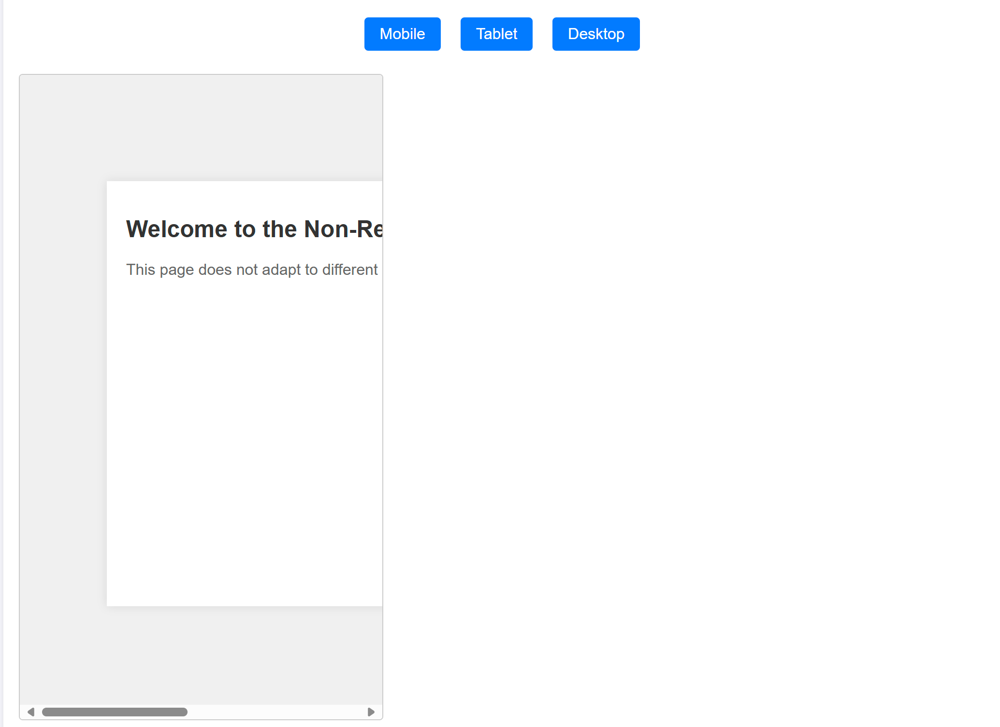
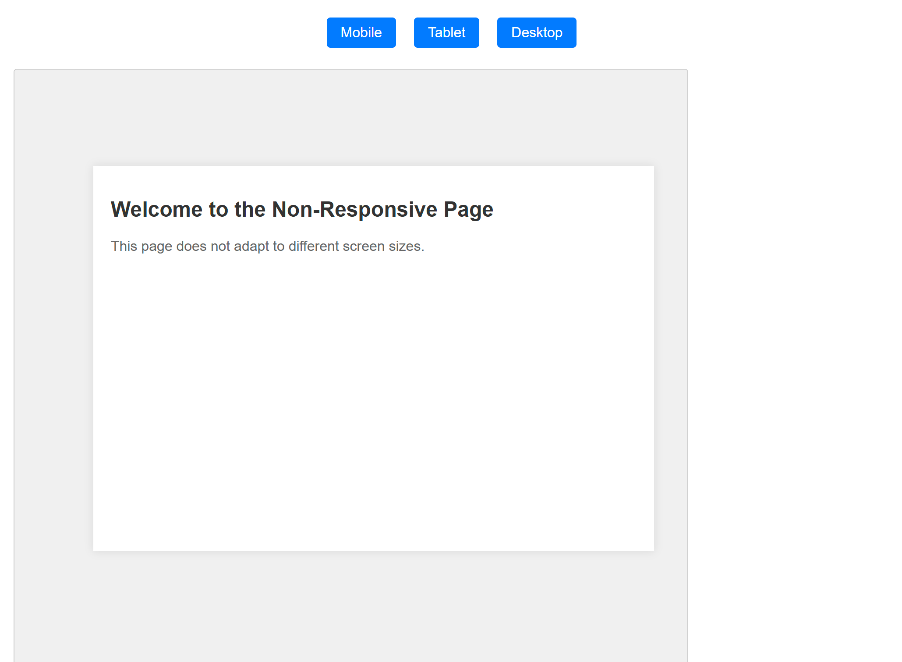
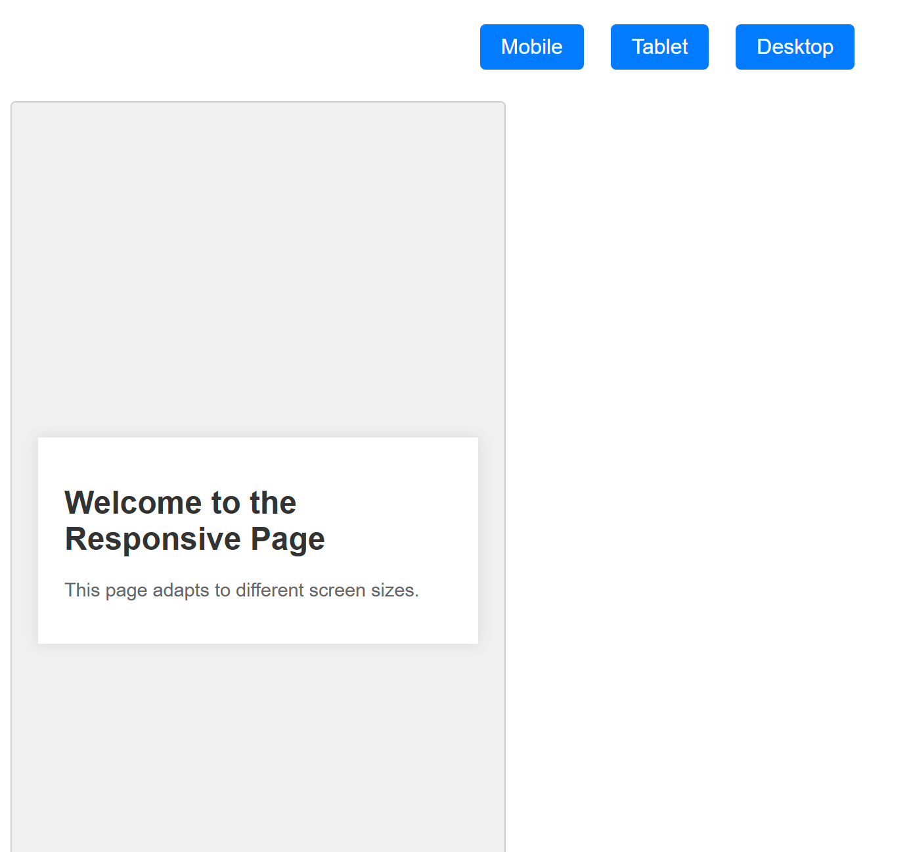
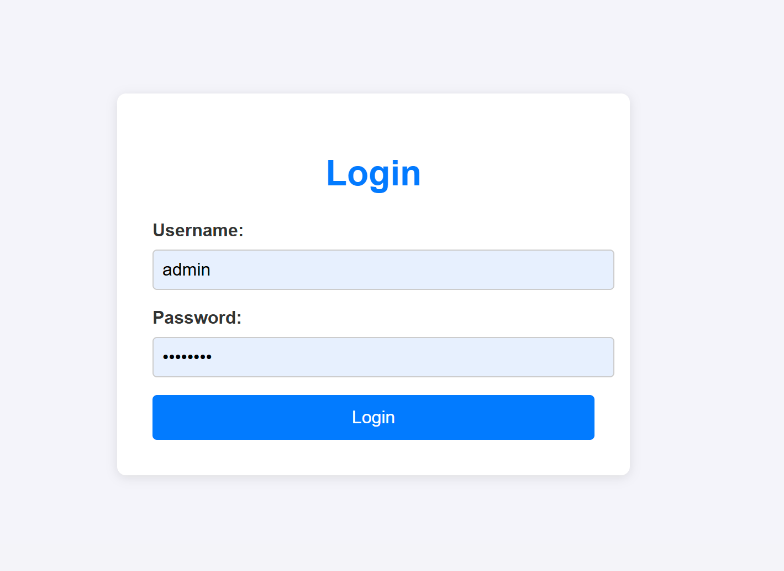
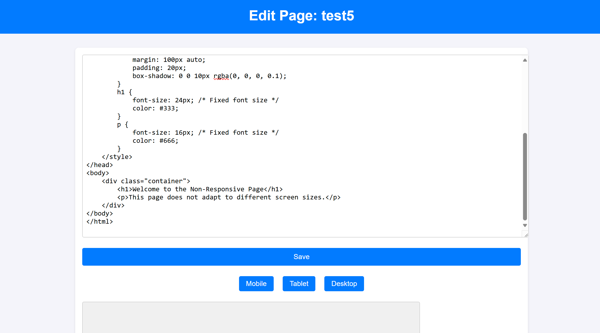
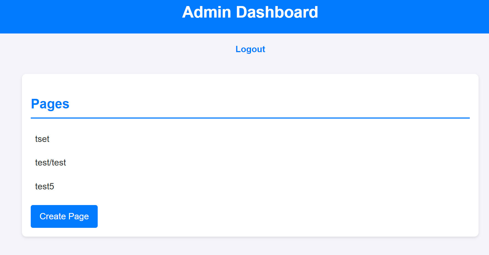

# Flask Admin Page and HTML Editor

This project is a simple Flask application that allows an administrator to log in, create, edit, and view pages through a user-friendly interface. The app uses a SQLite database to store user and page information. The goal is to build a responsive admin dashboard that allows for the management of pages with HTML content.

## Features

- **Login**: Admin can log in with the default credentials (username: `admin`, password: `password`).
- **Admin Dashboard**: Displays a list of all pages stored in the database.
- **Create Page**: A button that allows the admin to create new pages with custom names and content.
- **Edit Page**: Allows the admin to view and modify the HTML content of any page.
- **Responsive Design**: The app ensures that all pages are responsive and viewable on various devices.

## Setup

1. **Install Dependencies**

   Make sure you have Python 3.x installed. Install the required dependencies by running:

   ```bash
   pip install Flask Flask-SQLAlchemy Werkzeug
   ```

2. **Run the Application**

   Clone the repository, navigate to the project directory, and run the Flask app:

   ```bash
   python app.py
   ```

3. **Access the Admin Dashboard**

   Open your browser and go to:

   ```
   http://127.0.0.1:5000/login
   ```

   The default credentials are:
   - Username: `admin`
   - Password: `password`

## Database

The app uses a SQLite database (`pages.db`) to store user and page information.

- **User Table**: Stores the admin credentials.
- **Page Table**: Stores the page names and HTML content.

On the first run, the app will create a default user (`admin`) with the password `password` and a blank page table.

## Screenshots

### Example of Unresponsive Web Pages:



### Example of a Responsive Web Page:


### Login Page:


### HTML Editor:


### Example Page:


### Admin Dashboard:


## Routes

- **`/`**: Welcome page.
- **`/login`**: Login page for the admin.
- **`/logout`**: Logs the admin out and redirects to the login page.
- **`/admin`**: Admin dashboard showing a list of all pages.
- **`/admin/create_page`**: Allows the admin to create a new page.
- **`/admin/edit_page/<int:page_id>`**: Allows the admin to edit an existing page.

## Notes

- Only an authenticated user can access the admin dashboard or create/edit pages.
- The page editor allows the admin to view and modify the HTML content of a page.
- Pages can be created with custom names (only alphanumeric characters, underscores, and slashes allowed).

## Contributing

Feel free to fork this repository and submit pull requests. Contributions are welcome!

## License

This project is open-source and available for modification and use under the MIT license.

### MIT License

```
MIT License

Copyright (c) 2024 Ralph King

Permission is hereby granted, free of charge, to any person obtaining a copy
of this software and associated documentation files (the "Software"), to deal
in the Software without restriction, including without limitation the rights
to use, copy, modify, merge, publish, distribute, sublicense, and/or sell
copies of the Software, and to permit persons to whom the Software is
furnished to do so, subject to the following conditions:

The above copyright notice and this permission notice shall be included in all
copies or substantial portions of the Software.

THE SOFTWARE IS PROVIDED "AS IS", WITHOUT WARRANTY OF ANY KIND, EXPRESS OR
IMPLIED, INCLUDING BUT NOT LIMITED TO THE WARRANTIES OF MERCHANTABILITY,
FITNESS FOR A PARTICULAR PURPOSE AND NONINFRINGEMENT. IN NO EVENT SHALL THE
AUTHORS OR COPYRIGHT HOLDERS BE LIABLE FOR ANY CLAIM, DAMAGES OR OTHER
LIABILITY, WHETHER IN AN ACTION OF CONTRACT, TORT OR OTHERWISE, ARISING FROM,
OUT OF OR IN CONNECTION WITH THE SOFTWARE OR THE USE OR OTHER DEALINGS IN
THE SOFTWARE.
```
